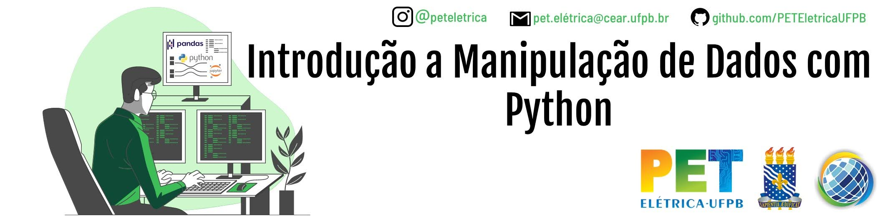

<h1 Align='center'>
  
      Minicurso - Introdução a Manipulação de Dados com Python
  
</h1>

## Requisitos para participar do curso
Conhecimento prévio de python:
  * Tipos de variáveis, estruturas básicas de controle de fluxo…

## Objetivos
Capacitar os alunos do curso de Engenharia Elétrica da UFPB e interessados em programação com a linguagem Python na realização de atividades envolvendo a obtenção de dados abertos e a manipulação destes.

## Metodologia
O curso será disponibilizado para a comunidade acadêmica interna e externa a UFPB na modalidade remota fazendo o uso de vídeo aulas elaboradas a partir do uso de slide e demonstração de todos os procedimentos com as ferramentas escolhidas. Além disso, algumas plataformas de apoio ao ensino serão utilizadas para o controle e o acompanhamento dos alunos durante o curso, como o Google Classroom e Edpuzzle.

## Resultados Esperados
  1. Viabilizar o desenvolvimento do conhecimento acerca de tecnologia.
  2. Despertar o interesse dos participantes acerca da linguagem de programação Python.
  3. Introduzir as formas de obter dados e retirar informações desse utilizando programação em código.
  4. Introduzir as diferentes formas de extensões de arquivos para obtenção de disponibilização de informações.
  5. Capacitar os participantes a respeito das bibliotecas disponíveis em Python para manipulação de dados.

